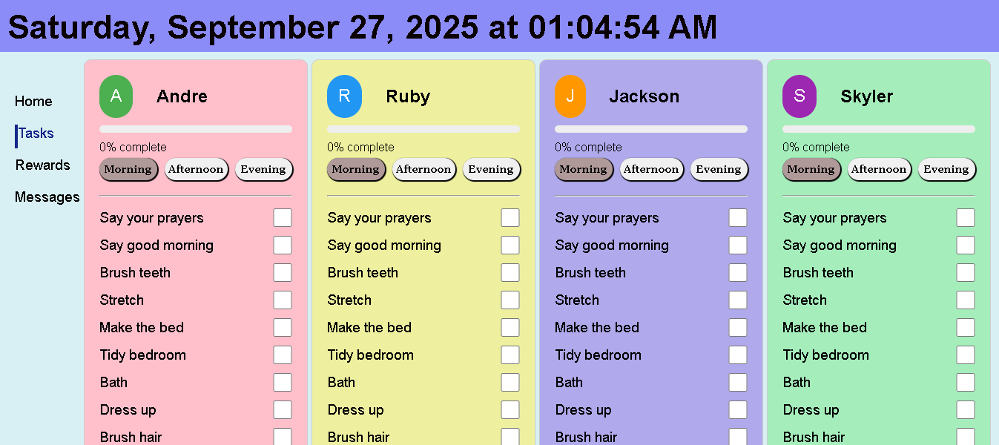

# Task App

A fun and interactive task management app built with React.  
This app was designed for kids (ages 6–12) to manage daily tasks and track progress in a simple, gamified way.  

## 🚀 Features
- User selection (each child has their own tasks)
- Tasks categorized into **Morning**, **Afternoon**, and **Evening**
- Tasks disappear when completed
- Animated progress tracker
- Points system for motivation
- Daily reset for new tasks

## 🛠️ Tech Stack
- React.js
- React Router

## 📸 Screenshot

## 🔗 Live Demo
👉 [View Live App](https://yourusername.github.io/task-app)

## 📂 Project Structure
- `/src` → Components, pages, and logic
- `/public` → Static assets
- `package.json` → Dependencies

## 📬 Contact
For collaborations or inquiries: obidikecrystal@gmail.com
